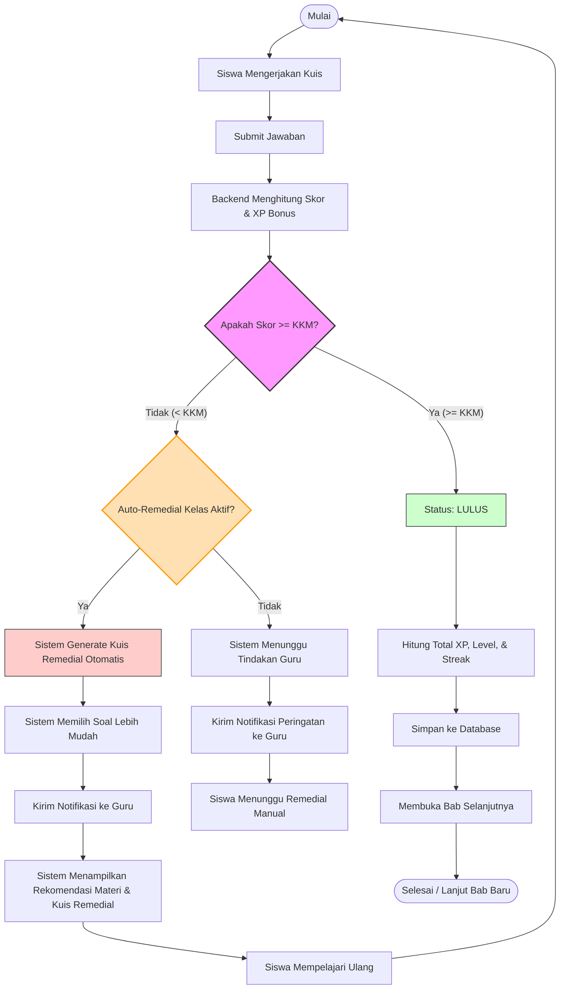
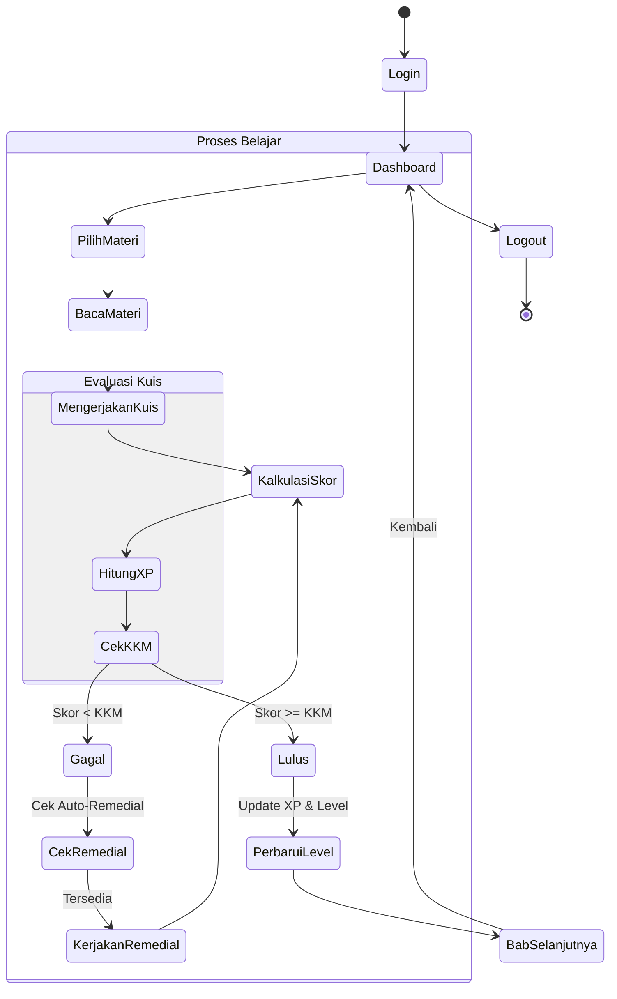
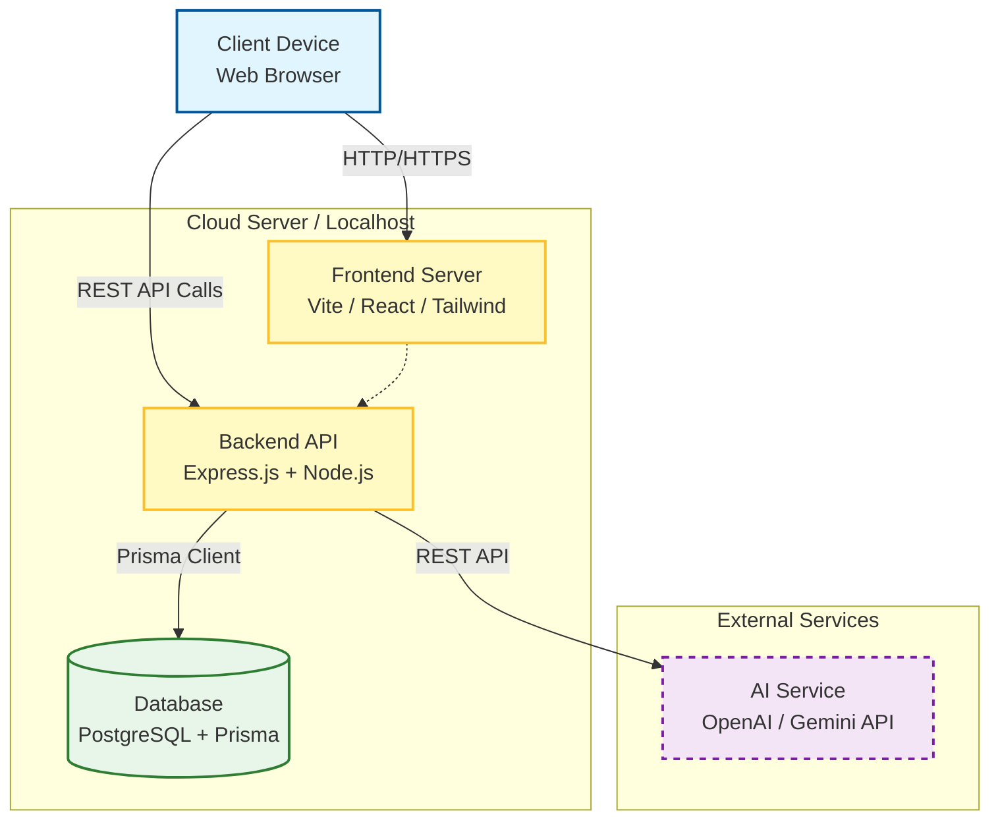
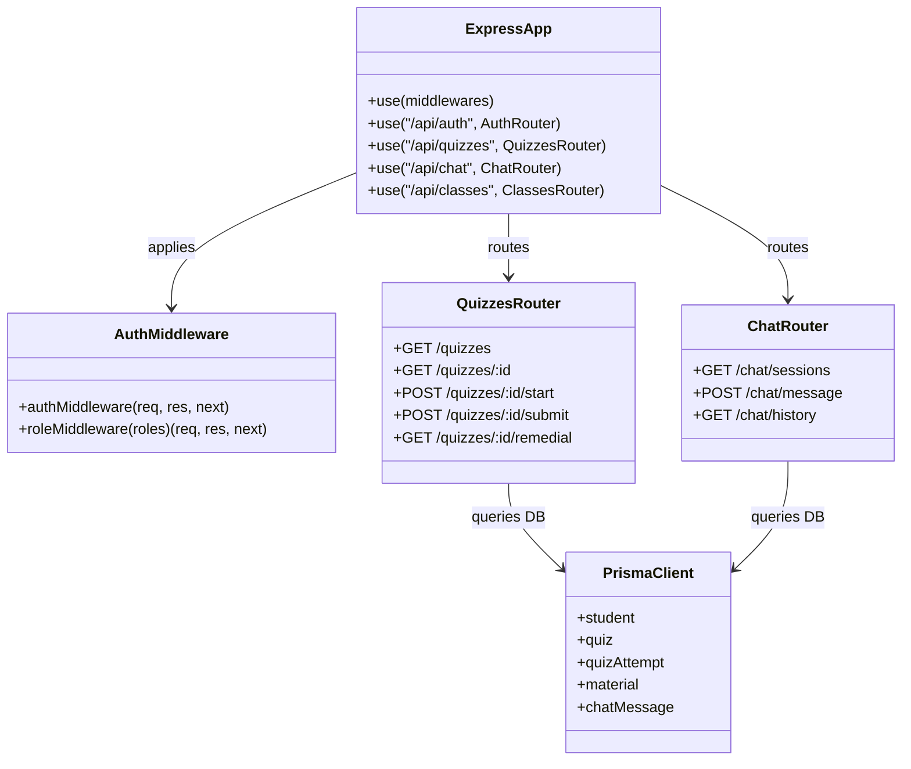

# Kumpulan Diagram Lengkap untuk Proposal TA - Adaptive Learning System (Updated)

Dokumen ini berisi kumpulan diagram **NON-SEQUENCE** (diagram pendukung lainnya) yang telah disesuaikan dengan implementasi *backend* terbaru.
Untuk **Sequence Diagram**, silakan lihat file terpisah: `proposal_sequence_diagrams.md`.

## Daftar Isi Diagram
1.  **Use Case Diagram**: Gambaran umum fungsionalitas sistem.
2.  **System Flowchart**: Logika algoritma adaptif (Brain) terbaru dengan Auto-Remedial.
3.  **Activity Diagram**: Alur aktivitas user (Process).
4.  **Deployment Diagram**: Arsitektur teknis server & layanan (Infrastructure).
5.  **Class Diagram**: Struktur kode backend (Structure).
6.  **Entity Relationship Diagram (ERD)**: Struktur database (Berdasarkan Prisma Schema terbaru).

---

## A. USE CASE DIAGRAM (Fungsionalitas Utama)
**Penjelasan:**
Diagram ini menggambarkan interaksi antara **3 Aktor Utama** (Siswa, Guru, Admin) dengan fitur-fitur yang disediakan oleh sistem berdasarkan implementasi saat ini.

```mermaid
usecaseDiagram
    actor "Siswa" as S
    actor "Guru" as G
    actor "Admin" as A

    package "Adaptive Learning System" {
        usecase "Login / Register" as UC1
        usecase "Mengerjakan Kuis & Remedial" as UC2
        usecase "Akses Materi & Progres" as UC3
        usecase "Lihat Leaderboard & Badge" as UC4
        usecase "Chat dengan AI Tutor" as UC5
        usecase "Kelola Materi, Bab & Soal" as UC6
        usecase "Kelola Kelas & Enrollment" as UC7
        usecase "Monitoring Siswa & Notifikasi" as UC8
        usecase "Audit Log Chat AI" as UC10
        usecase "Manajemen User & API Log" as UC9
    }

    S --> UC1
    S --> UC2
    S --> UC3
    S --> UC4
    S --> UC5
    
    G --> UC1
    G --> UC6
    G --> UC7
    G --> UC8
    G --> UC10
    
    A --> UC1
    A --> UC9
```

---

## B. SYSTEM FLOWCHART (Algoritma Adaptif Terkini)
**Penjelasan:**
Flowchart ini telah diperbarui sesuai logika *backend* di `quizzes.ts`. Sistem kini mendukung fitur **Auto-Remedial**. Jika siswa gagal dan fitur Auto-Remedial di kelas aktif, sistem akan secara otomatis membuatkan kuis remedial baru (tipe: `REMEDIAL`) yang mengambil soal dengan tingkat kesulitan lebih rendah, serta merekomendasikan materi yang belum diselesaikan.



---

## C. ACTIVITY DIAGRAM (Alur Aktivitas Umum)

### 1. Activity Diagram: Alur Belajar & XP Siswa
**Penjelasan:**
Menunjukkan siklus belajar dengan penambahan mekanisme XP, Leveling, dan Streak harian.



---

## D. DEPLOYMENT DIAGRAM (Arsitektur Sistem)
**Penjelasan:**
Sistem menggunakan arsitektur modern dengan React/Vite di sisi client, Node.js/Express di sisi backend, PostgreSQL dengan Prisma ORM sebagai database utama.



---

## E. CLASS DIAGRAM (Struktur Router Backend)
**Penjelasan:**
Diagram ini menggambarkan struktur kode backend (Berdasarkan Express Routers & Middleware).



---

## F. ENTITY RELATIONSHIP DIAGRAM (ERD)
**Penjelasan:**
Diagram relasi tabel database yang merefleksikan secara akurat `schema.prisma` yang diimplementasikan saat ini, termasuk `Notification`, `ApiLog`, dan `AuditLog`.

```mermaid
erDiagram
    %% ==================== USERS & AUTH ====================
    User ||--o| Student : "has"
    User ||--o| Teacher : "has"
    User ||--o| Admin : "has"
    User ||--o{ Notification : "receives"
    User ||--o{ PasswordResetToken : "requests"
    
    User {
        String id PK
        String email UK
        String password
        enum role "STUDENT|TEACHER|ADMIN"
        String name
        Boolean isActive
        Boolean isSuspended
        DateTime createdAt
    }
    
    Student {
        String id PK
        String userId FK
        String schoolId FK
        enum grade "X|XI|XII"
        Int currentLevel
        Int totalXP
        Int streakDays
    }
    
    Teacher {
        String id PK
        String userId FK
        String schoolId FK
        String nip
    }

    Admin {
        String id PK
        String userId FK
    }

    PasswordResetToken {
        String id PK
        String userId FK
        String token UK
        Boolean used
    }
    
    School {
        String id PK
        String name
        enum type "NEGERI|SWASTA"
        Boolean isActive
    }
    School ||--o{ Student : "has"
    School ||--o{ Teacher : "has"
    School ||--o{ Classroom : "has"
    
    %% ==================== CURRICULUM ====================
    Chapter {
        String id PK
        String name
        enum grade
        enum status
    }
    
    Material {
        String id PK
        String title
        String chapterId FK
        enum status
    }
    
    Quiz {
        String id PK
        String title
        String chapterId FK
        enum type "PLACEMENT|PRACTICE|POST_TEST|REMEDIAL"
        Int passingScore
        enum status
    }
    
    Chapter ||--o{ Material : "contains"
    Chapter ||--o{ Quiz : "contains"
    Chapter ||--o{ ClassroomChapter : "assigned to"
    
    %% ==================== QUESTIONS ====================
    Question {
        String id PK
        String text
        enum difficulty "EASY|MEDIUM|HARD"
        String chapterId FK
    }
    
    QuestionOption {
        String id PK
        String questionId FK
        String text
        Boolean isCorrect
    }
    
    QuizQuestion {
        String id PK
        String quizId FK
        String questionId FK
    }
    
    Question ||--o{ QuestionOption : "has"
    Question ||--o{ QuizQuestion : "used in"
    Quiz ||--o{ QuizQuestion : "contains"
    
    %% ==================== CLASS MANAGEMENT ====================
    Classroom {
        String id PK
        String name
        String joinCode UK
        String teacherId FK
        Boolean autoRemedial
        Int kkmScore
    }
    
    ClassroomEnrollment {
        String id PK
        String classroomId FK
        String studentId FK
        Boolean isActive
    }

    ClassroomChapter {
        String id PK
        String classroomId FK
        String chapterId FK
        Boolean isLocked
    }
    
    Teacher ||--o{ Classroom : "teaches"
    Classroom ||--o{ ClassroomEnrollment : "has"
    Classroom ||--o{ ClassroomChapter : "has"
    Student ||--o{ ClassroomEnrollment : "enrolled in"
    
    %% ==================== PROGRESS ====================
    MaterialProgress {
        String id PK
        String studentId FK
        String materialId FK
        Boolean isCompleted
    }

    QuizAttempt {
        String id PK
        String studentId FK
        String quizId FK
        Float score
        Boolean isPassed
    }
    
    QuizAttemptAnswer {
        String id PK
        String attemptId FK
        String questionId FK
        Boolean isCorrect
    }
    
    Student ||--o{ MaterialProgress : "has"
    Material ||--o{ MaterialProgress : "tracked by"
    Student ||--o{ QuizAttempt : "attempts"
    Quiz ||--o{ QuizAttempt : "attempted"
    QuizAttempt ||--o{ QuizAttemptAnswer : "contains"
    
    %% ==================== AI & CHAT ====================
    ChatSession {
        String id PK
        String studentId FK
    }
    
    ChatMessage {
        String id PK
        String sessionId FK
        enum role "USER|ASSISTANT|SYSTEM"
        String content
    }
    
    AuditLog {
        String id PK
        String messageId FK
        String teacherId FK
        enum status
    }
    
    Student ||--o{ ChatSession : "has"
    ChatSession ||--o{ ChatMessage : "contains"
    ChatMessage ||--o| AuditLog : "audited by"
    
    %% ==================== GAMIFICATION ====================
    Badge {
        String id PK
        String name
        Int xpReward
    }
    StudentBadge {
        String id PK
        String studentId FK
        String badgeId FK
    }
    Notification {
        String id PK
        String userId FK
        String type
        String message
    }
    Student ||--o{ StudentBadge : "earns"
    Badge ||--o{ StudentBadge : "awarded to"

    %% ==================== SYSTEM LOGS ====================
    ApiLog {
        String id PK
        String method
        String path
        Int statusCode
    }
```


