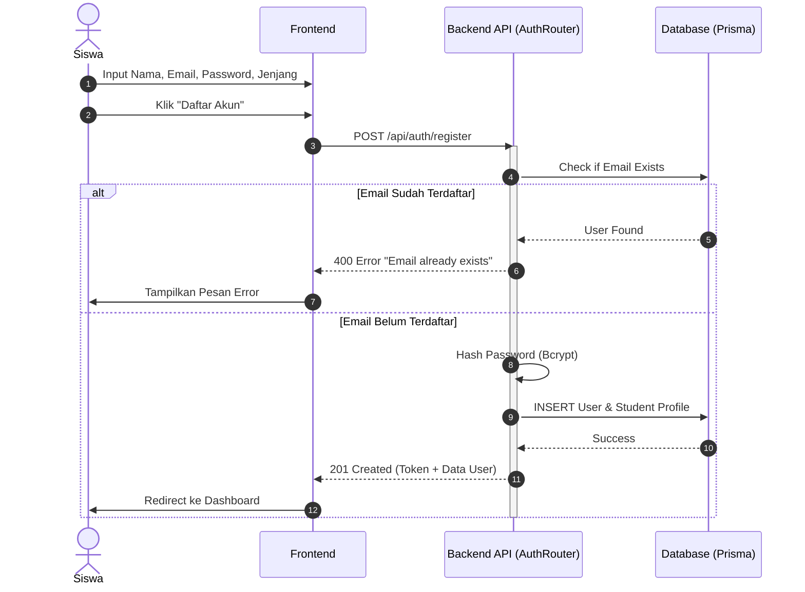
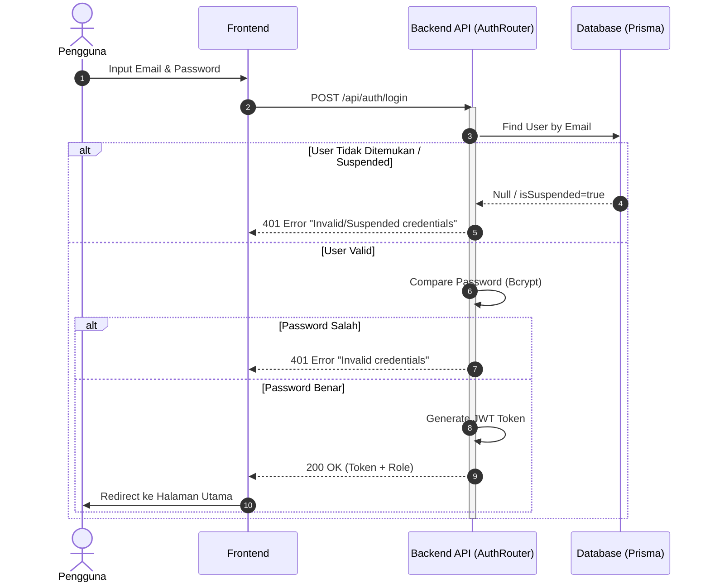
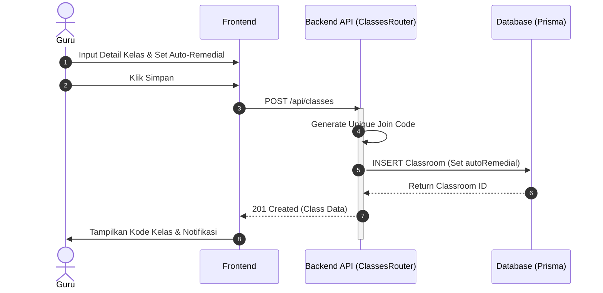
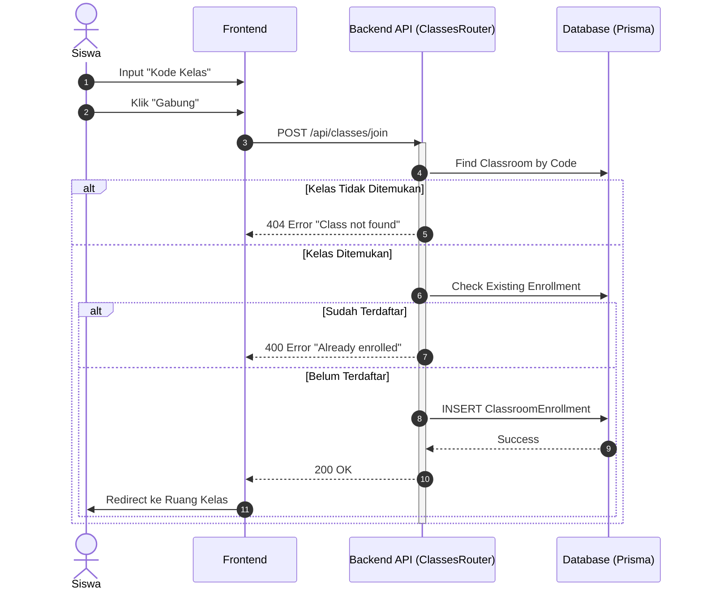
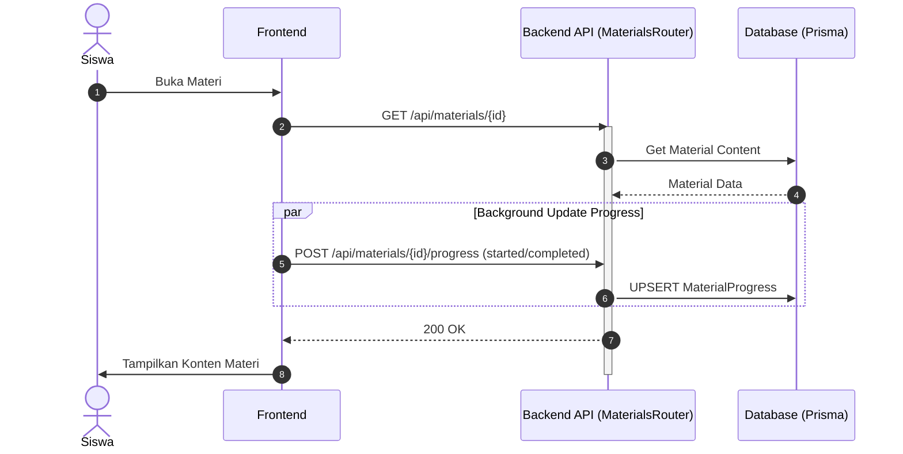
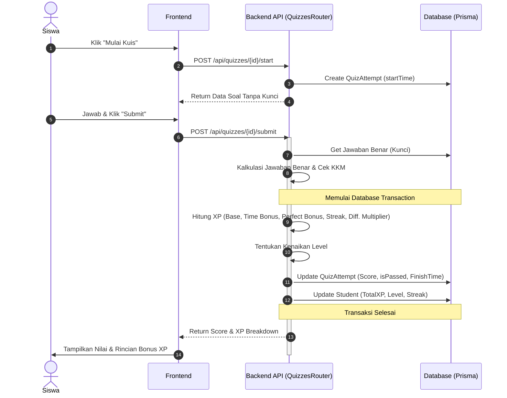
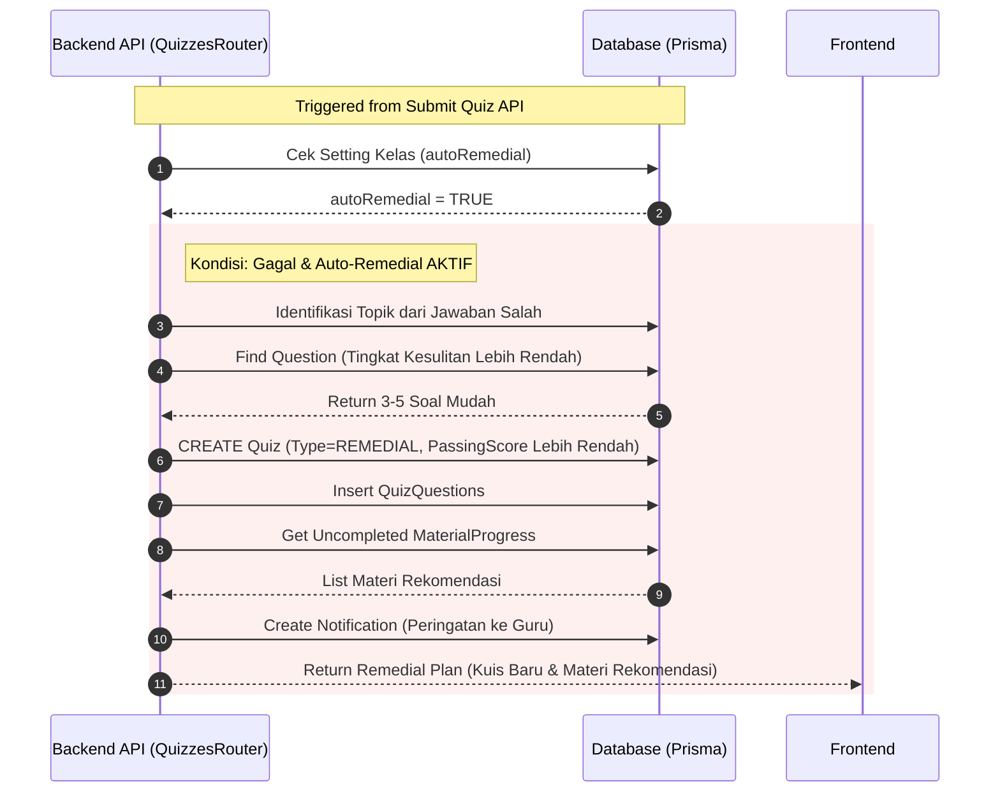
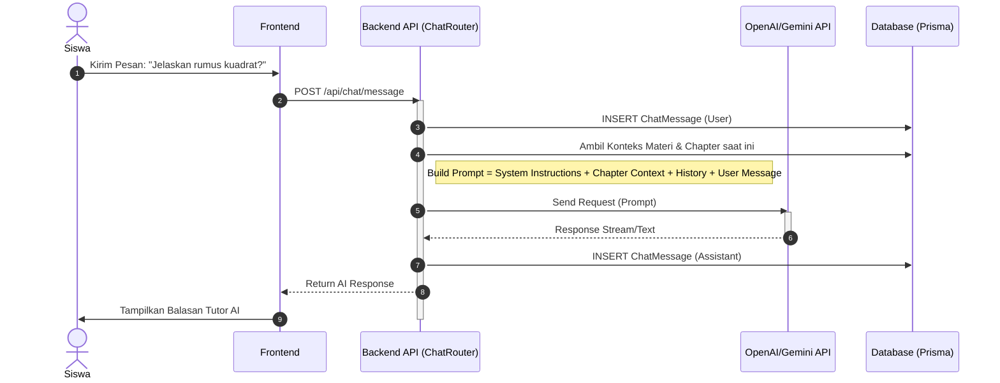
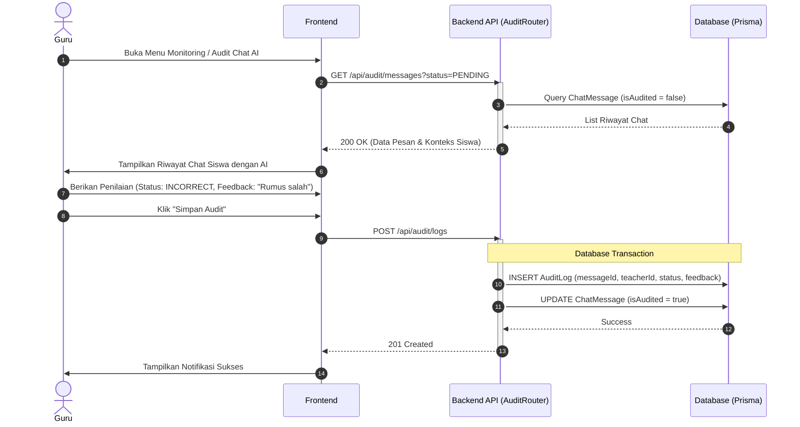
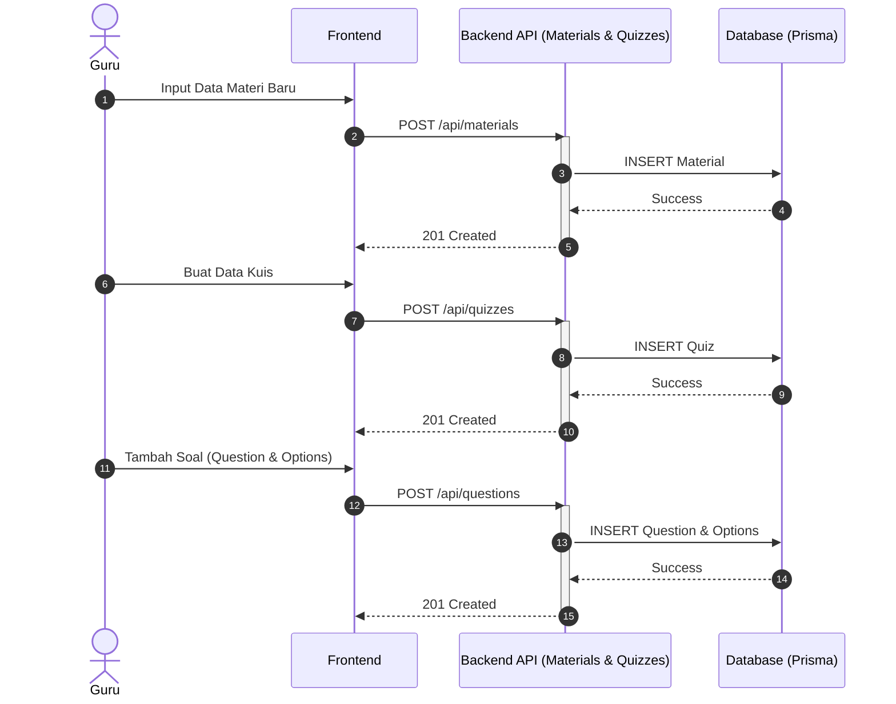

# Kumpulan Sequence Diagram untuk Proposal TA - Adaptive Learning System (Updated)

Berikut adalah seluruh diagram alur kerja (Sequence Diagram) yang telah disesuaikan dengan **implementasi backend terbaru**. Perubahan signifikan terdapat pada logika perhitungan XP yang kini realtime dan logika Auto-Remedial yang membuat kuis baru secara dinamis.

---

## 1. Modul Otentikasi (Authentication)

### 1.1 Sequence Diagram: Registrasi Siswa
**Penjelasan:**
Sistem memastikan pembuatan akun dan set default status `isActive = true`. Password di-hash sebelum disimpan ke tabel `User`, kemudian profil siswa ditambahkan ke tabel `Student`.

### 1.2 Sequence Diagram: Login Pengguna
**Penjelasan:**
Sistem memverifikasi email dan password terenkripsi. Jika `isSuspended` bernilai true, akses ditolak. Jika berhasil, JWT Token akan di-generate.

---

## 2. Modul Manajemen Kelas (Class Management)

### 2.1 Sequence Diagram: Guru Membuat Kelas
**Penjelasan:**
Saat guru membuat kelas, terdapat konfigurasi `autoRemedial` yang akan menentukan apakah siswa yang gagal otomatis dibuatkan kuis remedial.

### 2.2 Sequence Diagram: Siswa Bergabung Kelas

---

## 3. Modul Pembelajaran & Kuis

### 3.1 Sequence Diagram: Mengakses Materi
**Penjelasan:**
Sistem melacak progres materi dan memperbarui `MaterialProgress`.

### 3.2 Sequence Diagram: Mengerjakan Kuis & Perhitungan XP
**Penjelasan:**
Saat disubmit, sistem melakukan perhitungan skor, XP dasar, bonus waktu (Time Bonus), bonus jawaban sempurna, pengali kesulitan (Difficulty Multiplier), dan bonus konsistensi harian (Streak). Semua diproses secara simultan (Realtime) dalam satu `Transaction` database.

---

## 4. Modul Adaptif (Adaptive Logic) - FITUR UTAMA

### 4.1 Sequence Diagram: Auto-Remedial Logic (Saat Siswa Gagal Kuis)
**Penjelasan:**
Diagram ini dieksekusi **jika skor kuis < KKM** pada saat disubmit. Sistem mengecek pengaturan `autoRemedial` kelas. Jika aktif, sistem melakukan query untuk mencari soal-soal tingkat kesulitan lebih rendah dan men-generate secara otomatis `Quiz` baru dengan tipe `REMEDIAL`. Sistem juga membuat notifikasi untuk Guru.

---

## 5. Modul AI Tutor

### 5.1 Sequence Diagram: Chat dengan AI Terintegrasi Konteks
**Penjelasan:**
Sistem memuat riwayat percakapan dan *konteks materi* (Topik yang sedang dipelajari) untuk memberikan instruksi kepada LLM (OpenAI/Gemini API) agar jawabannya sangat relevan dengan kurikulum.

### 5.2 Sequence Diagram: Audit Log Chat AI oleh Guru
**Penjelasan:**
Karena penggunaan AI LLM memiliki risiko halusinasi (memberikan informasi salah), sistem menyediakan fitur Audit. Guru dapat meninjau riwayat percakapan AI dengan siswa, kemudian memberikan status penilaian (misalnya: `ACCURATE` atau `INCORRECT`) beserta *feedback* evaluasi yang disimpan ke dalam tabel `AuditLog`.

---

## 6. Modul Manajemen Konten (Guru)

### 6.1 Sequence Diagram: Upload Materi & Kuis
**Penjelasan:**
Alur kerja guru dalam membuat bab, memasukkan materi, dan membuat kuis.

